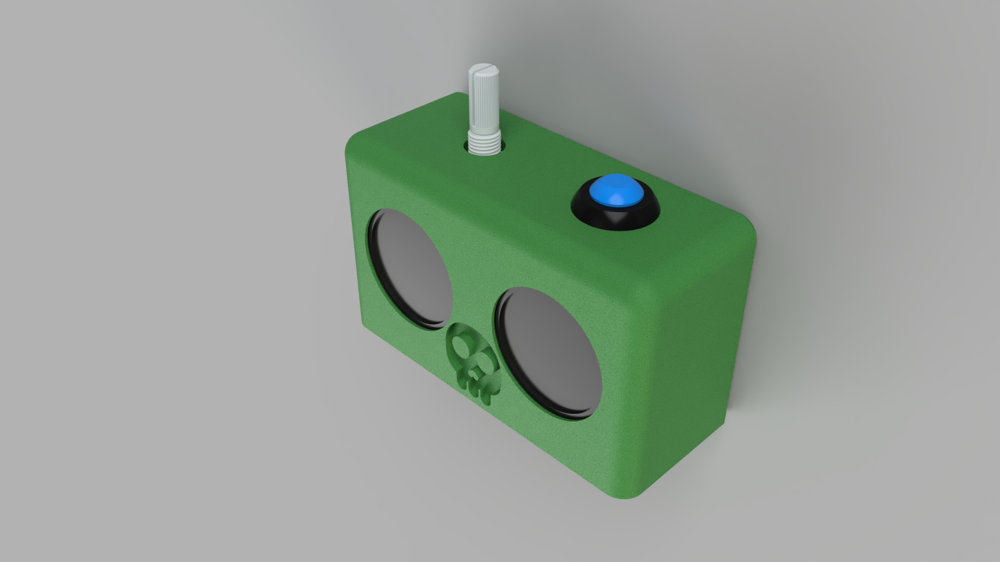
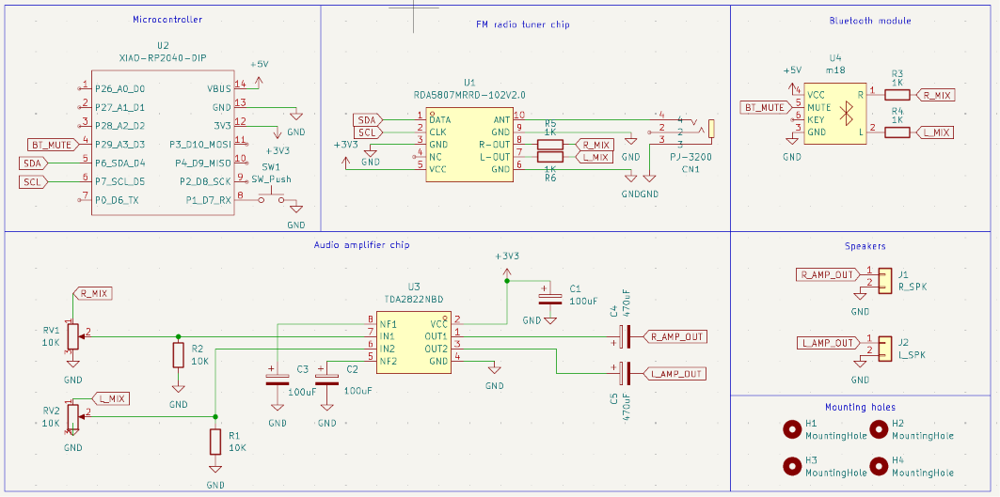
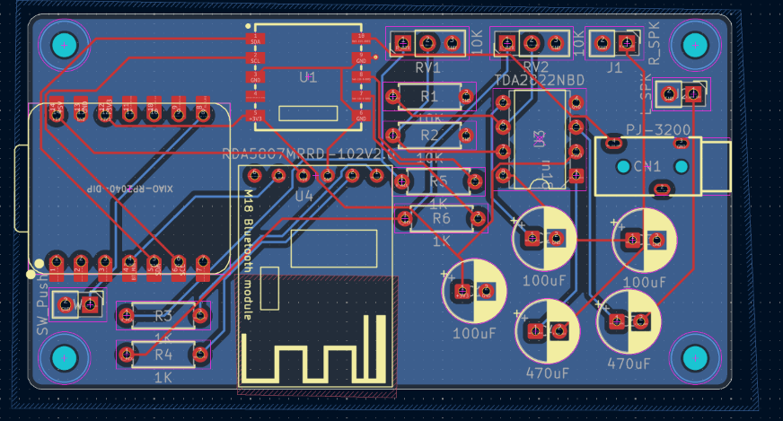

# Static-Speaker

 
View PCB on KiCanvas

This is my custom radio combined with a speaker designed for the YSWS Static
I chose this project to upgrade the standard kit by integrating an M18 Bluetooth module alongside the original RDA5807 FM radio chip, transforming it into a permanent Bluetooth speaker for my bedroom while keeping the physical over-the-air FM radio chip!

## Features:
- Bluetooth audio streaming directly from a phone
- Over-the-air local FM Radio playback
- One physical push-button to switch modes
- Dual analog potentiometers for volume control

## CAD Model:

## PCB

Schematic

Layout

PCB

## Firmware Overview
Runs on CircuitPython using an RDA5807 library wrapper. A `code.py` script handles I2C tuning for the FM radio, manages the M18 module's mute line via pin A3 (`BT_MUTE`), and toggles between Bluetooth and FM sources using a push button (`SW1`).

## File structure

There's 3 main folders: Firmware, PCB, and Production. The PCB folder contains .kicad_pcb, .kicad_pro, and .kicad_sch. The Firmware folder contains files for the Seeed Xiao code. The production folder will have files for the PCB printing.

## BOM (Bill of Materials):
Here should be everything you need to make this speaker
Most things should be what static sends you except the bluetooth module.

- 1x Seeed Studio XIAO RP2040
- 1x MH-M18 Bluetooth Audio Module
- 1x RDA5807FP FM Radio Tuner Chip
- 1x TDA2822 Audio Amplifier Chip
- 1x WH148 10kΩ Potentiometer
- 4x 1kΩ Resistors 
- 1x 3.5mm Jack (for FM Radio Antenna)
- 2x 10uF Capacitors
- 2x 100uF Capacitors
- 2x 30mm Speakers
- 1x 12mm Momentary Push Button Mode switch
- Hookup wire (for off-board connections)
- 1x Custom PCB

## Software

- Kicad recommended to view the Gerber files or the general `.pcb` `.pro` `.sch` files
- Thonny or VSCode for programming the board.

## Tools:

- Soldering Iron
- Solder

## How to build/replicate
1. **Gather Parts:** Get **everything** that is on the BOM.
2. **Solder the PCB:** Solder all components onto your custom PCB using a soldering iron.
3. **Print & Mount Case:** 3D print your enclosure design, then mechanically secure and screw the potentiometers (`RV1`/`RV2`) and push button (`SW1`) into place.
4. **Wire Peripherals:** Wire your speakers to `J1` and `J2`, and plug a cable into the 3.5mm jack (`CN1`) to serve as the FM antenna.
5. **Flash Firmware:** Install **CircuitPython** onto your Seeed XIAO RP2040.
6. **Add Code Files:** Copy the `RDA5807.py` library and your `code.py` script directly onto the board's `CIRCUITPY` drive.
7. **Power Up & Test:** Connect USB power (+5V). Pair your phone via Bluetooth to the M18 module or press the push button (`SW1`) to switch over to FM radio mode.
8. **Enjoy:** Adjust your volume knobs and enjoy your custom speaker!

## Extra stuff
In Hackpad style -
Hi guys

Bye guys